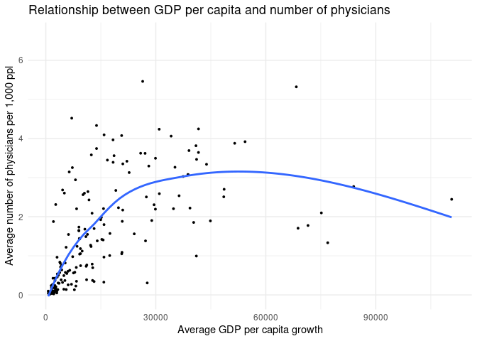
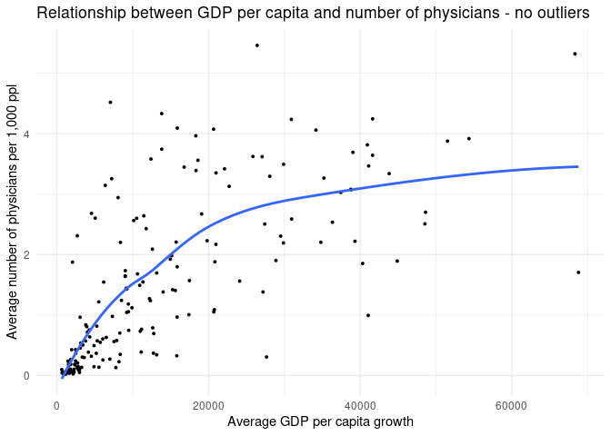
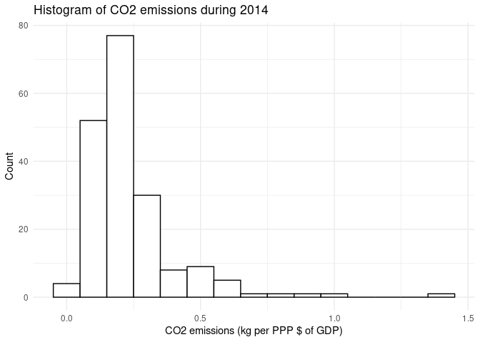
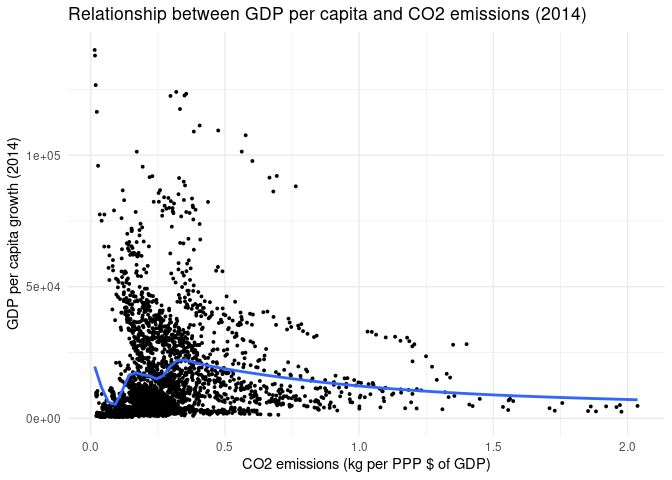
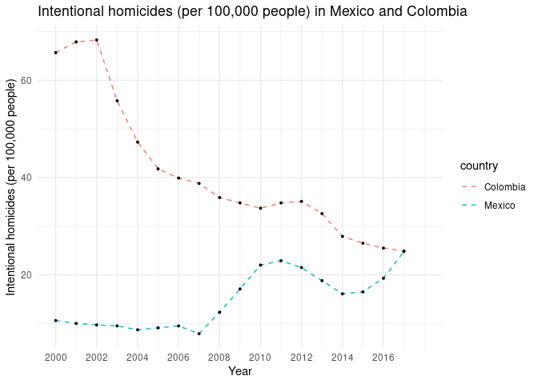

Exploring World Bank Data
================
Maria Benavides

## Load necessary libraries

``` r
library(tidyverse)
```

    ## ── Attaching packages ──────────────────────────────────────────────────────────────── tidyverse 1.3.0 ──

    ## ✓ ggplot2 3.3.0     ✓ purrr   0.3.3
    ## ✓ tibble  3.0.0     ✓ dplyr   0.8.5
    ## ✓ tidyr   1.0.2     ✓ stringr 1.4.0
    ## ✓ readr   1.3.1     ✓ forcats 0.5.0

    ## ── Conflicts ─────────────────────────────────────────────────────────────────── tidyverse_conflicts() ──
    ## x dplyr::filter() masks stats::filter()
    ## x dplyr::lag()    masks stats::lag()

## Write a function to import the data files

``` r
# Create the function that imports and tiddies the data frame

import_tiddy_data <- function(x) {
  country_data <- read_csv(x, skip = 3)  %>%
      rename(
        indicator_name = `Indicator Name`
      ) %>%
      select(
        -c(4:44),  # I decided to drop most years, to have a more simple data frame
        -X65
      ) %>%
      filter( # I added these variables thinking of GDP as a measure of development
        indicator_name %in% c("GDP per capita growth (annual %)", 
                         "Physicians (per 1,000 people)",
                         "Hospital beds (per 1,000 people)",
                         "Literacy rate, adult total (% of people ages 15 and above)", 
                         "Intentional homicides (per 100,000 people)", 
                         "Human capital index (HCI) (scale 0-1)", 
                         "Fertility rate, total (births per woman)", 
                         "Prevalence of undernourishment (% of population)", 
                         "Unemployment, total (% of total labor force) (national estimate)", 
                         "CO2 emissions (kg per PPP $ of GDP)", 
                         "Access to electricity (% of population)",
                         "GDP per capita, PPP (current international $)"                         
                         )
      ) %>%
      pivot_longer(
        cols = c(4:23), 
        names_to = "year", 
        values_to = "indicator_value"
      ) %>%
      mutate(
        year = as.numeric(year) 
      ) %>%
      pivot_wider(
        names_from = indicator_name, 
        values_from = indicator_value
      ) %>%
      rename(
        country = `Country Name`, 
        country_code = `Country Code`,
        gdp_growth = `GDP per capita growth (annual %)`, 
        gdp_pc = `GDP per capita, PPP (current international $)`, 
        physicians = `Physicians (per 1,000 people)`, 
        hospital_beds = `Hospital beds (per 1,000 people)`,
        literacy_rate = `Literacy rate, adult total (% of people ages 15 and above)`,
        homicide_1000ppl = `Intentional homicides (per 100,000 people)`, 
        hci = `Human capital index (HCI) (scale 0-1)`,
        fertility_rate = `Fertility rate, total (births per woman)`,
        undernourushment = `Prevalence of undernourishment (% of population)`,
        unemployment = `Unemployment, total (% of total labor force) (national estimate)`,
        co2_emissions = `CO2 emissions (kg per PPP $ of GDP)`,
        electricity = `Access to electricity (% of population)`
      )
    
 return(country_data) # Recall to return the desire output 
}    
```

## Import the data

``` r
# Import all files using the function

countries <- list.files("data_world_bank")  # Create a vector with the names of all files

wb_database <- import_tiddy_data(
  paste(
    "data_world_bank/",countries[1], sep = "") # To make it more precise, use paste to merge 
                                               # folder name and files names
  )

for (country in countries[2:217]) {           # Use for loop to import all files at once
  country_database <- import_tiddy_data(
    paste(
      "data_world_bank/",country, sep = "")
    )
  wb_database <- rbind(wb_database, country_database) # Combine all data frames into one
}
```

## Explore the data

``` r
theme_set(new = theme_minimal()) # I think I finally figured out the theme set issue 

# ANALYSIS 1 
# Calculate average growth GDP per capita for each country (2000-2019) and the average number 
# of physicians

average_gdp_phy <- group_by(wb_database, country) %>%
  summarise(
    average_gdp = mean(gdp_pc, na.rm = TRUE), 
    average_phy = mean(physicians, na.rm = TRUE)
  )

average_gdp_phy_nooutliers <- group_by(wb_database, country) %>% # Dropping the highest GDP
  summarise(
    average_gdp = mean(gdp_pc, na.rm = TRUE), 
    average_phy = mean(physicians, na.rm = TRUE)
  ) %>%
  filter(
    average_gdp <= 70000
  )

# Use a plot to determine is there is any relationship between the average GDP growth and average
# number of physicians per 1,000 people

ggplot(average_gdp_phy, aes(x=average_gdp, y=average_phy)) + 
  geom_point(size = 0.7) +
  labs(
    title="Relationship between GDP per capita and number of physicians", 
    x="Average GDP per capita growth", 
    y="Average number of physicians per 1,000 ppl"
    ) +
  geom_smooth(se = FALSE)
```

    ## `geom_smooth()` using method = 'loess' and formula 'y ~ x'

    ## Warning: Removed 31 rows containing non-finite values (stat_smooth).

    ## Warning: Removed 31 rows containing missing values (geom_point).

<!-- -->

``` r
ggplot(average_gdp_phy_nooutliers, aes(x=average_gdp, y=average_phy)) + 
  geom_point(size = 0.7) +
  labs(
    title="Relationship between GDP per capita and number of physicians - no outliers", 
    x="Average GDP per capita growth", 
    y="Average number of physicians per 1,000 ppl"
    ) +
  geom_smooth(se = FALSE)
```

    ## `geom_smooth()` using method = 'loess' and formula 'y ~ x'

    ## Warning: Removed 10 rows containing non-finite values (stat_smooth).

    ## Warning: Removed 10 rows containing missing values (geom_point).

<!-- -->

According to the first plot, there is **no clear relationship** between
the average GDP per capita, and the annual average number of physicians
per 1,000 people, considering data from 2000 to 2019. Nonetheless, when
we drop the outliers values (GDP \> 70000 PPP), a more positive
relationship starts to appear. In consideration of current events
(COVID-19 pandemic) we could think that the most wealthy countries are
better prepare to face this situation.

``` r
# ANALYSIS 2 
# Filter dataframe to use only the variable of interest and a given year 

co2_2014 <- wb_database %>%
  filter(
    year == 2014 # 2014 is the most recent year with more values for the CO2 variable
  ) %>% 
  select(
    country, 
    co2_emissions, 
    gdp_pc
  )
  
# Create a histogram to understand the distribution of the C02 emissions variable 

ggplot(co2_2014, aes(x=co2_emissions)) + 
  geom_histogram(binwidth = 0.1, color = "black", fill = "white") + 
  labs(
    title="Histogram of CO2 emissions during 2014", 
    x="CO2 emissions (kg per PPP $ of GDP)", 
    y="Count"
    )
```

    ## Warning: Removed 27 rows containing non-finite values (stat_bin).

<!-- -->

``` r
# Find the relationship between CO2 emissions and GDP growth

ggplot(wb_database, aes(x=co2_emissions, y=gdp_pc)) + 
  geom_point(size = 0.7) +
  labs(
    title="Relationship between GDP per capita and CO2 emissions (2014)", 
    x="CO2 emissions (kg per PPP $ of GDP)", 
    y="GDP per capita growth (2014)"
    ) +
  geom_smooth(se = FALSE)
```

    ## `geom_smooth()` using method = 'gam' and formula 'y ~ s(x, bs = "cs")'

    ## Warning: Removed 1519 rows containing non-finite values (stat_smooth).

    ## Warning: Removed 1519 rows containing missing values (geom_point).

<!-- -->

The histogram shows that most countries have a similar level of CO2
emissions. Nonetheless, there are some exceptions. We could think,
first, that those countries that produce more emissions, are the
wealthiest, but the second graph shows no clear relationship between the
two variables.

``` r
# ANALYSIS 3
# Filter dataframe to use only the variable of interest 

violence_col_mex <- wb_database %>%
  filter(
    country_code == "COL" | 
      country_code == "MEX" 
  ) %>% 
  select(
    country, 
    homicide_1000ppl, 
    year
  )
  
# Create a line graph to see the trend on homicides in Colombia and Mexico 

ggplot(violence_col_mex, aes(x=year, y=homicide_1000ppl)) + 
  geom_line(aes(color = country,), 
            linetype = "dashed") +
  scale_x_continuous(limits = c(2000, 2018),
                     breaks = c(2000, 2002, 2004, 2006, 2008, 2010, 2012, 2014, 2016)) + 
  geom_point(size=0.7) +
  labs(
    title="Intentional homicides (per 100,000 people) in Mexico and Colombia", 
    x="Year", 
    y="Intentional homicides (per 100,000 people)"
    )
```

    ## Warning: Removed 4 row(s) containing missing values (geom_path).

    ## Warning: Removed 4 rows containing missing values (geom_point).

<!-- -->

Colombia and Mexico have suffered from internal conflicts and violence
for decades. We can see in this graph, thought, that Colombia’s
situation is historically worse. Even after a peace agreement signed in
2016, Colombia had higher homicide rates. Mexico’s situation is
worsening, especially after the Calderon administration
    (2016).

## Session info

``` r
devtools::session_info()
```

    ## ─ Session info ───────────────────────────────────────────────────────────────
    ##  setting  value                               
    ##  version  R version 3.6.3 (2020-02-29)        
    ##  os       Red Hat Enterprise Linux 8.1 (Ootpa)
    ##  system   x86_64, linux-gnu                   
    ##  ui       X11                                 
    ##  language (EN)                                
    ##  collate  en_US.UTF-8                         
    ##  ctype    en_US.UTF-8                         
    ##  tz       America/Chicago                     
    ##  date     2020-05-03                          
    ## 
    ## ─ Packages ───────────────────────────────────────────────────────────────────
    ##  package     * version date       lib source        
    ##  assertthat    0.2.1   2019-03-21 [2] CRAN (R 3.6.3)
    ##  backports     1.1.5   2019-10-02 [2] CRAN (R 3.6.3)
    ##  broom         0.5.5   2020-02-29 [2] CRAN (R 3.6.3)
    ##  callr         3.4.3   2020-03-28 [2] CRAN (R 3.6.3)
    ##  cellranger    1.1.0   2016-07-27 [2] CRAN (R 3.6.3)
    ##  cli           2.0.2   2020-02-28 [2] CRAN (R 3.6.3)
    ##  colorspace    1.4-1   2019-03-18 [2] CRAN (R 3.6.3)
    ##  crayon        1.3.4   2017-09-16 [2] CRAN (R 3.6.3)
    ##  DBI           1.1.0   2019-12-15 [2] CRAN (R 3.6.3)
    ##  dbplyr        1.4.2   2019-06-17 [2] CRAN (R 3.6.3)
    ##  desc          1.2.0   2018-05-01 [2] CRAN (R 3.6.3)
    ##  devtools      2.3.0   2020-04-10 [1] CRAN (R 3.6.3)
    ##  digest        0.6.25  2020-02-23 [2] CRAN (R 3.6.3)
    ##  dplyr       * 0.8.5   2020-03-07 [2] CRAN (R 3.6.3)
    ##  ellipsis      0.3.0   2019-09-20 [2] CRAN (R 3.6.3)
    ##  evaluate      0.14    2019-05-28 [2] CRAN (R 3.6.3)
    ##  fansi         0.4.1   2020-01-08 [2] CRAN (R 3.6.3)
    ##  farver        2.0.3   2020-01-16 [2] CRAN (R 3.6.3)
    ##  forcats     * 0.5.0   2020-03-01 [2] CRAN (R 3.6.3)
    ##  fs            1.4.0   2020-03-31 [2] CRAN (R 3.6.3)
    ##  generics      0.0.2   2018-11-29 [2] CRAN (R 3.6.3)
    ##  ggplot2     * 3.3.0   2020-03-05 [2] CRAN (R 3.6.3)
    ##  glue          1.4.0   2020-04-03 [1] CRAN (R 3.6.3)
    ##  gtable        0.3.0   2019-03-25 [2] CRAN (R 3.6.3)
    ##  haven         2.2.0   2019-11-08 [2] CRAN (R 3.6.3)
    ##  hms           0.5.3   2020-01-08 [2] CRAN (R 3.6.3)
    ##  htmltools     0.4.0   2019-10-04 [2] CRAN (R 3.6.3)
    ##  httr          1.4.1   2019-08-05 [2] CRAN (R 3.6.3)
    ##  jsonlite      1.6.1   2020-02-02 [2] CRAN (R 3.6.3)
    ##  knitr         1.28    2020-02-06 [2] CRAN (R 3.6.3)
    ##  labeling      0.3     2014-08-23 [2] CRAN (R 3.6.3)
    ##  lattice       0.20-38 2018-11-04 [2] CRAN (R 3.6.3)
    ##  lifecycle     0.2.0   2020-03-06 [2] CRAN (R 3.6.3)
    ##  lubridate     1.7.8   2020-04-06 [1] CRAN (R 3.6.3)
    ##  magrittr      1.5     2014-11-22 [2] CRAN (R 3.6.3)
    ##  Matrix        1.2-18  2019-11-27 [2] CRAN (R 3.6.3)
    ##  memoise       1.1.0   2017-04-21 [2] CRAN (R 3.6.3)
    ##  mgcv          1.8-31  2019-11-09 [2] CRAN (R 3.6.3)
    ##  modelr        0.1.6   2020-02-22 [2] CRAN (R 3.6.3)
    ##  munsell       0.5.0   2018-06-12 [2] CRAN (R 3.6.3)
    ##  nlme          3.1-144 2020-02-06 [2] CRAN (R 3.6.3)
    ##  pillar        1.4.3   2019-12-20 [2] CRAN (R 3.6.3)
    ##  pkgbuild      1.0.6   2019-10-09 [2] CRAN (R 3.6.3)
    ##  pkgconfig     2.0.3   2019-09-22 [2] CRAN (R 3.6.3)
    ##  pkgload       1.0.2   2018-10-29 [2] CRAN (R 3.6.3)
    ##  prettyunits   1.1.1   2020-01-24 [2] CRAN (R 3.6.3)
    ##  processx      3.4.2   2020-02-09 [2] CRAN (R 3.6.3)
    ##  ps            1.3.2   2020-02-13 [2] CRAN (R 3.6.3)
    ##  purrr       * 0.3.3   2019-10-18 [2] CRAN (R 3.6.3)
    ##  R6            2.4.1   2019-11-12 [2] CRAN (R 3.6.3)
    ##  Rcpp          1.0.4   2020-03-17 [2] CRAN (R 3.6.3)
    ##  readr       * 1.3.1   2018-12-21 [2] CRAN (R 3.6.3)
    ##  readxl        1.3.1   2019-03-13 [2] CRAN (R 3.6.3)
    ##  remotes       2.1.1   2020-02-15 [2] CRAN (R 3.6.3)
    ##  reprex        0.3.0   2019-05-16 [2] CRAN (R 3.6.3)
    ##  rlang         0.4.5   2020-03-01 [2] CRAN (R 3.6.3)
    ##  rmarkdown     2.1     2020-01-20 [2] CRAN (R 3.6.3)
    ##  rprojroot     1.3-2   2018-01-03 [2] CRAN (R 3.6.3)
    ##  rstudioapi    0.11    2020-02-07 [2] CRAN (R 3.6.3)
    ##  rvest         0.3.5   2019-11-08 [2] CRAN (R 3.6.3)
    ##  scales        1.1.0   2019-11-18 [2] CRAN (R 3.6.3)
    ##  sessioninfo   1.1.1   2018-11-05 [2] CRAN (R 3.6.3)
    ##  stringi       1.4.6   2020-02-17 [2] CRAN (R 3.6.3)
    ##  stringr     * 1.4.0   2019-02-10 [2] CRAN (R 3.6.3)
    ##  testthat      2.3.2   2020-03-02 [2] CRAN (R 3.6.3)
    ##  tibble      * 3.0.0   2020-03-30 [2] CRAN (R 3.6.3)
    ##  tidyr       * 1.0.2   2020-01-24 [2] CRAN (R 3.6.3)
    ##  tidyselect    1.0.0   2020-01-27 [2] CRAN (R 3.6.3)
    ##  tidyverse   * 1.3.0   2019-11-21 [1] CRAN (R 3.6.3)
    ##  usethis       1.6.0   2020-04-09 [1] CRAN (R 3.6.3)
    ##  vctrs         0.2.4   2020-03-10 [2] CRAN (R 3.6.3)
    ##  withr         2.1.2   2018-03-15 [2] CRAN (R 3.6.3)
    ##  xfun          0.12    2020-01-13 [2] CRAN (R 3.6.3)
    ##  xml2          1.3.0   2020-04-01 [2] CRAN (R 3.6.3)
    ##  yaml          2.2.1   2020-02-01 [2] CRAN (R 3.6.3)
    ## 
    ## [1] /home/mabenavides/R/x86_64-redhat-linux-gnu-library/3.6
    ## [2] /usr/lib64/R/library
    ## [3] /usr/share/R/library
